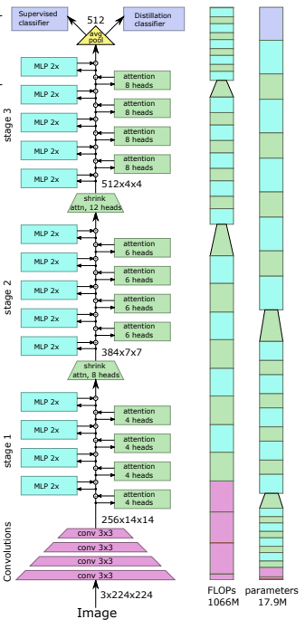

## LeViT

</img>

"We design a family of image classification architectures that optimize the trade-off between accuracy and efficiency in a high-speed regime. Our work exploits recent findings in attention-based architectures, which are competitive on highly parallel processing hardware. We revisit principles from the extensive literature on convolutional neural networks to apply them to transformers, in particular activation maps with decreasing resolutions. We also introduce the attention bias, a new way to integrate positional information in vision transformers. As a result, we propose LeVIT: a hybrid neural network for fast inference image classification. We consider different measures of efficiency on different hardware platforms, so as to best reflect a wide range of application scenarios. Our extensive experiments empirically validate our technical choices and show they are suitable to most architectures. Overall, LeViT significantly outperforms existing convnets and vision transformers with respect to the speed/accuracy tradeoff. For example, at 80% ImageNet top-1 accuracy, LeViT is 5 times faster than EfficientNet on CPU." 

### Research Paper:
- https://arxiv.org/abs/2104.01136

### Official repository:
- https://github.com/facebookresearch/LeViT

### Usage:
```python
import numpy

key = jax.random.PRNGKey(0)

img = jax.random.normal(key, (1, 224, 224, 3))

v = LeViT(
    image_size = 224,
    num_classes = 1000,
    stages = 3,             # number of stages
    dim = (256, 384, 512),  # dimensions at each stage
    depth = 4,              # transformer of depth 4 at each stage
    heads = (4, 6, 8),      # heads at each stage
    mlp_mult = 2,
    dropout = 0.1
)

init_rngs = {'params': jax.random.PRNGKey(1), 
            'dropout': jax.random.PRNGKey(2)}

params = v.init(init_rngs, img)
output = v.apply(params, img, mutable=['batch_stats'], rngs=init_rngs)

n_params_flax = sum(
    jax.tree_leaves(jax.tree_map(lambda x: numpy.prod(x.shape), params))
)
print(f"Number of parameters in Flax model: {n_params_flax}")
```

```bibtex
@article{DBLP:journals/corr/abs-2104-01136,
  author    = {Benjamin Graham and
               Alaaeldin El{-}Nouby and
               Hugo Touvron and
               Pierre Stock and
               Armand Joulin and
               Herv{\'{e}} J{\'{e}}gou and
               Matthijs Douze},
  title     = {LeViT: a Vision Transformer in ConvNet's Clothing for Faster Inference},
  journal   = {CoRR},
  volume    = {abs/2104.01136},
  year      = {2021},
  url       = {https://arxiv.org/abs/2104.01136},
  eprinttype = {arXiv},
  eprint    = {2104.01136},
  timestamp = {Mon, 12 Apr 2021 16:14:56 +0200},
  biburl    = {https://dblp.org/rec/journals/corr/abs-2104-01136.bib},
  bibsource = {dblp computer science bibliography, https://dblp.org}
}
```